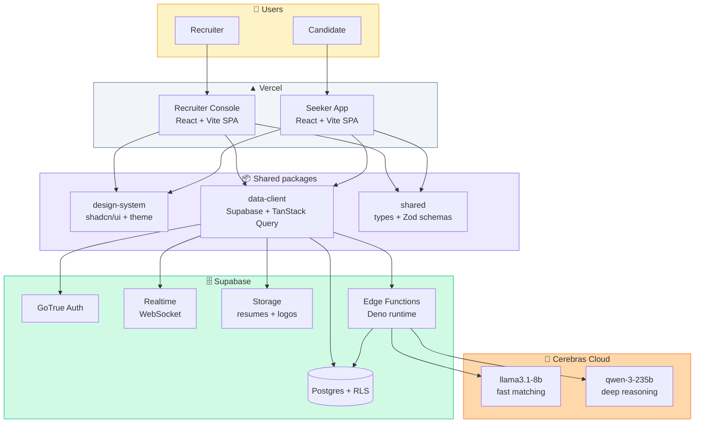
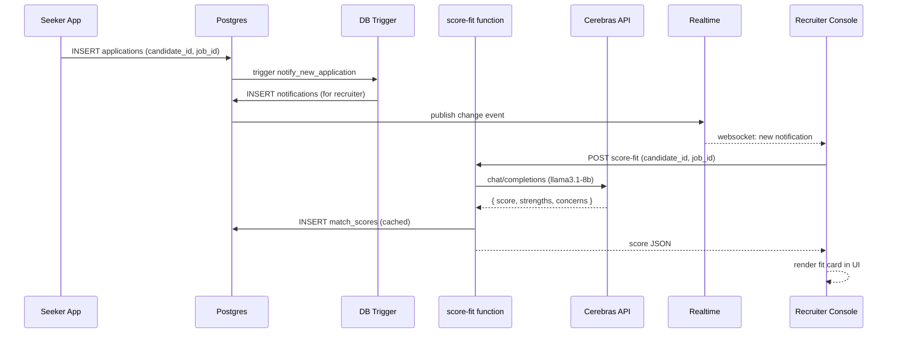
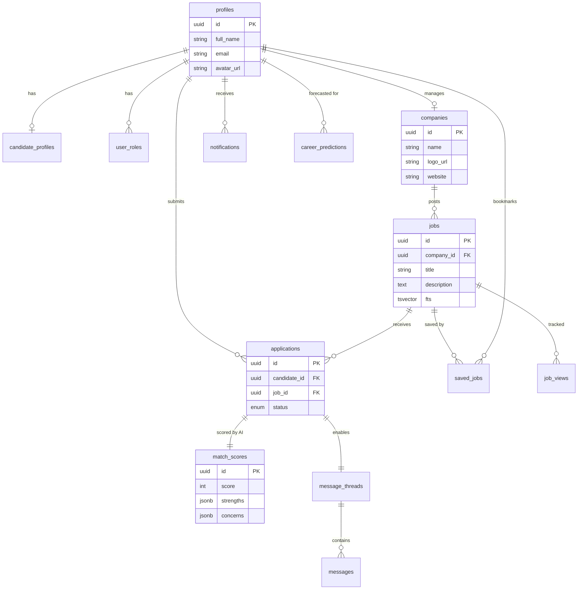
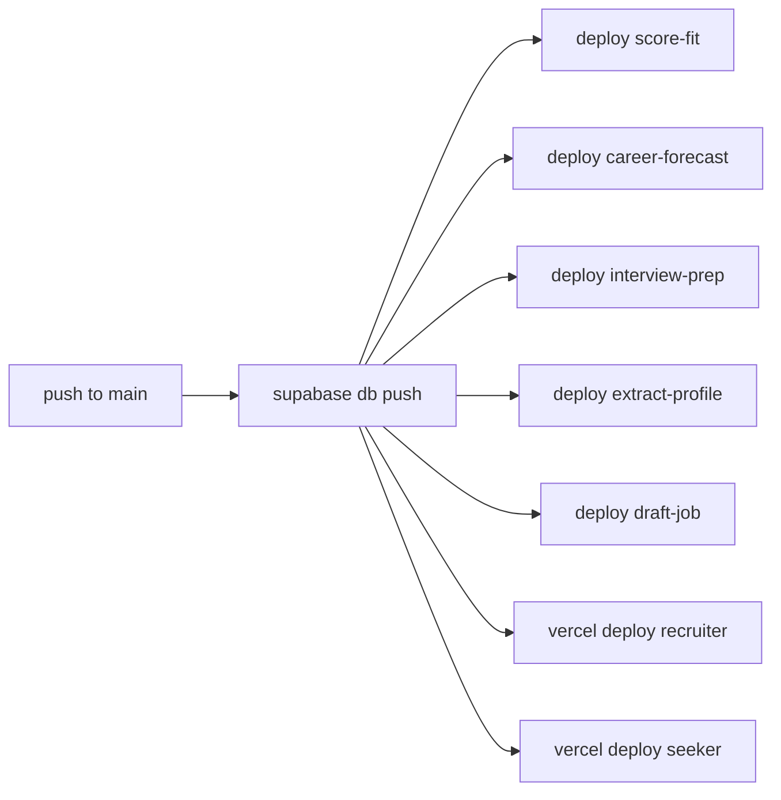

<div align="center">

# 🔥 Talentforge

### An AI-powered two-sided job matching platform

_Where recruiters find their next hire and candidates find their next move — both guided by AI that actually understands fit._

<br />


<br />

[**Live demo**](#-live-deployments) · [**Architecture**](#-architecture) · [**Features**](#-key-features) · [**Getting started**](#-getting-started) · [**AI features**](#-the-five-ai-features)

</div>

---

## 📑 Table of contents

- [Overview](#-overview)
- [Key features](#-key-features)
- [Architecture](#-architecture)
- [Tech stack](#-tech-stack)
- [Project structure](#-project-structure)
- [The five AI features](#-the-five-ai-features)
- [Database schema](#-database-schema)
- [Security model](#-security-model--row-level-security)
- [Getting started](#-getting-started)
- [Environment variables](#-environment-variables)
- [Development workflow](#-development-workflow)
- [Deployment](#-deployment)
- [Live deployments](#-live-deployments)
- [Screenshots](#-screenshots)
- [Contributing](#-contributing)
- [License](#-license)

---

## 🎯 Overview

**Talentforge** is a modern job marketplace split into two focused single-page apps that share one Supabase backend:

| Portal                   | For                         | What they do                                                                                                      |
| ------------------------ | --------------------------- | ----------------------------------------------------------------------------------------------------------------- |
| 🏢 **Recruiter Console** | Employers & hiring managers | Post jobs with AI assistance, review applicants, read AI-generated fit scores, message candidates in realtime     |
| 👤 **Seeker App**        | Job seekers & candidates    | Discover openings with instant match %, track applications, get AI career forecasts, practice interview questions |

> **Five AI features** power the experience — job fit scoring, career forecasting, interview preparation, resume extraction, and AI-drafted job postings — all running on [**Cerebras Cloud**](https://cerebras.ai) for industry-leading inference speed.

---

## ✨ Key features

<table>
<tr>
<td width="50%" valign="top">

### 🏢 For recruiters

- 📝 **AI-drafted job postings** — turn a rough title into a full description
- 📊 **Smart applicant pipeline** — Kanban view of all applications
- 🎯 **AI fit scores** — strengths, concerns, and 0-100 match scores for every applicant
- 💬 **Realtime messaging** — direct candidate conversations without leaving the app
- 🔔 **Live notifications** — instant alerts for new applications
- 🏗️ **Company profile** — logo, culture, size, and open roles in one place

</td>
<td width="50%" valign="top">

### 👤 For job seekers

- 🔍 **Smart job search** — instant match % on every listing
- 📄 **AI resume parser** — upload a PDF, profile autofills
- 🔮 **Career forecast** — 1/3/5-year trajectory predictions
- 🎓 **Interview prep** — AI-generated questions for roles you're interviewing for
- 🔖 **Saved jobs** — bookmark and apply when ready
- 📈 **Application tracker** — timeline view of every status change

</td>
</tr>
</table>

---

## 🏛️ Architecture

Talentforge is a **serverless-first** platform. There is no custom Node/Express backend — browsers talk directly to Postgres through Supabase's auto-generated REST layer, and Row-Level Security policies in the database are the authorization layer.



### Data flow example — a candidate applying for a job



---

## 🛠️ Tech stack

### Frontend

| Category            | Technology                                                                | Why we chose it                                      |
| ------------------- | ------------------------------------------------------------------------- | ---------------------------------------------------- |
| **Framework**       | [React 19](https://react.dev)                                             | Latest concurrent features, server components ready  |
| **Build tool**      | [Vite 6](https://vite.dev)                                                | Instant HMR, native ESM, tiny production bundles     |
| **Language**        | [TypeScript 5.8](https://www.typescriptlang.org)                          | Type safety end-to-end from DB to UI                 |
| **Routing**         | [TanStack Router](https://tanstack.com/router)                            | File-based routes with typed URL params              |
| **Server state**    | [TanStack Query](https://tanstack.com/query)                              | Automatic caching, deduplication, optimistic updates |
| **Client state**    | [Zustand](https://github.com/pmndrs/zustand)                              | Minimal, zero-boilerplate global stores              |
| **Styling**         | [Tailwind CSS 4](https://tailwindcss.com)                                 | Utility-first, zero CSS files to maintain            |
| **Components**      | [shadcn/ui](https://ui.shadcn.com) + [Radix UI](https://www.radix-ui.com) | We own the source — customize freely                 |
| **Animations**      | [Framer Motion](https://www.framer.com/motion/)                           | Spring physics, orchestrated transitions             |
| **Forms**           | [react-hook-form](https://react-hook-form.com) + [Zod](https://zod.dev)   | Minimal re-renders, schema-based validation          |
| **Command palette** | [cmdk](https://cmdk.paco.me)                                              | ⌘K search across routes                              |
| **Icons**           | [lucide-react](https://lucide.dev)                                        | Consistent, tree-shakeable icon set                  |
| **Toasts**          | [Sonner](https://sonner.emilkowal.ski)                                    | Minimal, beautiful notifications                     |

### Backend

| Category        | Technology                                                            | Purpose                                              |
| --------------- | --------------------------------------------------------------------- | ---------------------------------------------------- |
| **Database**    | PostgreSQL (via Supabase)                                             | Relational store with RLS as authorization           |
| **Auth**        | [Supabase GoTrue](https://supabase.com/docs/guides/auth)              | Email/password, session cookies, password reset      |
| **Realtime**    | [Supabase Realtime](https://supabase.com/docs/guides/realtime)        | WebSocket subscriptions for messages + notifications |
| **Storage**     | [Supabase Storage](https://supabase.com/docs/guides/storage)          | Resume PDFs, company logos, job attachments          |
| **Serverless**  | [Supabase Edge Functions](https://supabase.com/docs/guides/functions) | Deno runtime for AI orchestration                    |
| **AI provider** | [Cerebras Cloud](https://cerebras.ai)                                 | Blazing fast LLM inference (2000+ tok/s)             |
| **AI models**   | `llama3.1-8b`, `qwen-3-235b-a22b-instruct-2507`                       | Fast scoring + deep structured reasoning             |

### Tooling & DevOps

| Category             | Technology                                                                                            |
| -------------------- | ----------------------------------------------------------------------------------------------------- |
| **Monorepo**         | [pnpm workspaces](https://pnpm.io/workspaces) + [Turborepo](https://turbo.build)                      |
| **Linting**          | [ESLint](https://eslint.org) + [Prettier](https://prettier.io)                                        |
| **Git hooks**        | [Husky](https://typicode.github.io/husky) + [lint-staged](https://github.com/lint-staged/lint-staged) |
| **CI**               | [GitHub Actions](https://github.com/features/actions)                                                 |
| **Hosting (web)**    | [Vercel](https://vercel.com)                                                                          |
| **Hosting (db/fns)** | [Supabase](https://supabase.com)                                                                      |

---

## 📂 Project structure

```
talentforge/
│
├── 📱 apps/
│   ├── recruiter-console/          # React SPA — employer portal (port 5173)
│   │   ├── src/
│   │   │   ├── routes/             # TanStack file-based routes
│   │   │   ├── features/           # Feature-first organization
│   │   │   │   ├── jobs/           # Job CRUD + AI draft
│   │   │   │   ├── applications/   # Applicant pipeline
│   │   │   │   └── messaging/      # Realtime threads
│   │   │   ├── components/         # App-specific components
│   │   │   └── main.tsx
│   │   └── vite.config.ts
│   │
│   └── seeker-app/                 # React SPA — candidate portal (port 5174)
│       └── src/
│           ├── routes/
│           └── features/
│               ├── jobs/           # Browse + match scores
│               ├── applications/   # Status tracking
│               ├── career/         # AI career forecast
│               ├── interview/      # AI interview prep
│               └── profile/        # Resume upload + parse
│
├── 📦 packages/
│   ├── design-system/              # Shared UI primitives
│   │   ├── components/ui/          # shadcn components (Button, Card, Input…)
│   │   ├── components/motion/      # FadeIn, Stagger, CountUp, GradientOrb…
│   │   └── styles/globals.css      # Tailwind theme + custom palette
│   │
│   ├── shared/                     # Shared types & utilities
│   │   ├── types/                  # TypeScript interfaces
│   │   ├── validations/            # Zod schemas (forms + API)
│   │   ├── constants/              # Enums, labels, status maps
│   │   └── utils/                  # Date formatting, helpers
│   │
│   └── data-client/                # Supabase client + React Query hooks
│       ├── client.ts               # Typed Supabase browser client
│       ├── hooks/                  # One file per resource
│       │   ├── useJobs.ts
│       │   ├── useApplications.ts
│       │   ├── useMatchScores.ts
│       │   ├── useMessageThreads.ts
│       │   ├── useNotifications.ts
│       │   ├── useSavedJobs.ts
│       │   ├── useCareerForecast.ts
│       │   ├── useAuth.ts
│       │   └── useRealtime.ts
│       └── types/database.ts       # Auto-generated from Supabase schema
│
├── 🗄️ supabase/
│   ├── migrations/                 # SQL migrations (schema, RLS, triggers)
│   │   ├── 0001_schema.sql         # 13 tables
│   │   ├── 0002_indexes.sql        # FTS + FK indexes
│   │   ├── 0003_functions.sql      # Triggers & helpers
│   │   ├── 0004_rls.sql            # Row-level security
│   │   ├── 0005_auth_hook.sql      # Signup → profile sync
│   │   └── 0006_storage.sql        # Buckets + policies
│   │
│   ├── functions/                  # Deno edge functions
│   │   ├── _shared/
│   │   │   ├── cors.ts
│   │   │   ├── supabase.ts
│   │   │   └── cerebras.ts         # Unified AI client
│   │   ├── score-fit/              # Candidate-job matching
│   │   ├── career-forecast/        # 1/3/5-year predictions
│   │   ├── interview-prep/         # Role-specific Q&A
│   │   ├── extract-profile/        # Resume PDF → JSON
│   │   └── draft-job/              # AI job posting generator
│   │
│   └── seed.sql                    # Local dev sample data
│
├── 🔧 scripts/                     # Node.js helper scripts
│   ├── run-migrations.mjs
│   └── demo-reset-and-seed.mjs
│
├── ⚙️ .github/workflows/
│   ├── ci.yml                      # Lint + typecheck + build on PR
│   └── deploy.yml                  # Migrate + deploy functions + Vercel
│
├── Makefile                        # Developer shortcuts
├── turbo.json                      # Build pipeline
├── pnpm-workspace.yaml
├── package.json
└── .env.example
```

---

## 🧠 The five AI features

All five features route through one shared helper (`supabase/functions/_shared/cerebras.ts`) so the AI provider is swappable in a single file.

<table>
<tr>
<th width="25%">Feature</th>
<th width="25%">Triggered when</th>
<th width="35%">What it does</th>
<th width="15%">Model</th>
</tr>
<tr>
<td>🎯 <b>score-fit</b></td>
<td>Candidate opens the jobs list</td>
<td>Compares candidate profile vs. job, returns 0-100 match % with strengths + concerns. Batches 5 jobs per call. Cached in <code>match_scores</code>.</td>
<td><code>llama3.1-8b</code></td>
</tr>
<tr>
<td>🔮 <b>career-forecast</b></td>
<td>Candidate opens <code>/career</code></td>
<td>Projects 1/3/5-year career trajectory — likely roles, skills to acquire, salary bands. Cached per candidate.</td>
<td><code>qwen-3-235b</code></td>
</tr>
<tr>
<td>🎓 <b>interview-prep</b></td>
<td>Application status = <code>interviewing</code></td>
<td>Generates 5-8 role-specific interview questions with suggested talking points.</td>
<td><code>qwen-3-235b</code></td>
</tr>
<tr>
<td>📄 <b>extract-profile</b></td>
<td>Candidate uploads resume PDF</td>
<td>Uses <code>unpdf</code> to extract text, then LLM returns structured JSON (skills, experience, education, links) to autofill the profile form.</td>
<td><code>qwen-3-235b</code></td>
</tr>
<tr>
<td>✍️ <b>draft-job</b></td>
<td>Recruiter clicks "Draft with AI"</td>
<td>Takes a rough title + notes, outputs a full job posting (description, requirements, nice-to-haves).</td>
<td><code>qwen-3-235b</code></td>
</tr>
</table>

### Why Cerebras?

Cerebras Cloud delivers industry-leading inference speed (2000+ tokens/second on Llama 3.1-8B) via an OpenAI-compatible API. The result: match scores that feel instant, not async.

---

## 🗃️ Database schema

Thirteen tables power the platform. All are protected by Row-Level Security policies defined in `0004_rls.sql`.



| #   | Table                | Purpose                                                            |
| --- | -------------------- | ------------------------------------------------------------------ |
| 1   | `profiles`           | Every user — 1:1 with `auth.users`                                 |
| 2   | `user_roles`         | `candidate` or `employer` (separate for future multi-role support) |
| 3   | `companies`          | Employer organizations — logo, description, size, website          |
| 4   | `candidate_profiles` | Headline, bio, skills, experience, education, links, preferences   |
| 5   | `jobs`               | Postings with generated `fts` column for full-text search          |
| 6   | `applications`       | Candidate ↔ job join with status lifecycle                         |
| 7   | `match_scores`       | Cached AI scores per (candidate, job)                              |
| 8   | `career_predictions` | Cached 1/3/5-year forecast JSON                                    |
| 9   | `message_threads`    | One per application                                                |
| 10  | `messages`           | Individual messages (realtime)                                     |
| 11  | `notifications`      | In-app bell-icon alerts                                            |
| 12  | `saved_jobs`         | Candidate bookmarks                                                |
| 13  | `job_views`          | Analytics                                                          |

---

## 🔐 Security model — Row-Level Security

Instead of writing custom auth middleware, **Postgres enforces authorization at the row level**. Every request goes through RLS policies that evaluate against the current user's JWT.

### Example policies

```sql
-- Candidates can only read their OWN match scores
CREATE POLICY "candidates read own scores" ON match_scores
  FOR SELECT USING (
    auth.uid() = (SELECT candidate_id FROM applications WHERE id = application_id)
  );

-- Employers only see applications to THEIR OWN jobs
CREATE POLICY "employers read own applications" ON applications
  FOR SELECT USING (
    EXISTS (
      SELECT 1 FROM jobs j
      JOIN companies c ON c.id = j.company_id
      WHERE j.id = applications.job_id AND c.owner_id = auth.uid()
    )
  );

-- Messages visible only to thread participants
CREATE POLICY "thread members only" ON messages
  FOR SELECT USING (
    EXISTS (
      SELECT 1 FROM message_threads t
      WHERE t.id = thread_id
      AND (t.candidate_id = auth.uid() OR t.employer_id = auth.uid())
    )
  );
```

Even if the frontend has a bug that asks for every match score in the database, Postgres returns an empty list. **The firewall is the database.**

---

## 🚀 Getting started

### Prerequisites

| Tool               | Version  | Install                                                                         |
| ------------------ | -------- | ------------------------------------------------------------------------------- |
| **Node.js**        | ≥ 20 LTS | [nodejs.org](https://nodejs.org)                                                |
| **pnpm**           | ≥ 10     | `npm i -g pnpm`                                                                 |
| **Docker Desktop** | latest   | [docker.com](https://docker.com) (for local Supabase)                           |
| **Supabase CLI**   | latest   | `scoop install supabase` (Windows) / `brew install supabase/tap/supabase` (Mac) |
| **Git**            | any      | [git-scm.com](https://git-scm.com)                                              |

### 1. Clone & install

```bash
git clone https://github.com/shubhamkarad/talentforge.git
cd talentforge
pnpm install
```

### 2. Set up environment

```bash
cp .env.example .env.local
# Open .env.local and fill in values — see "Environment variables" below
```

### 3. Start Supabase locally

```bash
pnpm supabase:start
```

This spins up Postgres, GoTrue, Realtime, Storage, and Studio on local ports. All migrations in `supabase/migrations/` apply automatically.

> **Don't want to run Docker?** Skip this and point `VITE_SUPABASE_URL` at a hosted Supabase project.

### 4. Generate TypeScript types

```bash
pnpm supabase:types
```

Regenerates `packages/data-client/src/types/database.ts` from the live schema.

### 5. Run both apps

```bash
pnpm dev
```

This boots:

- 🏢 Recruiter Console → http://localhost:5173
- 👤 Seeker App → http://localhost:5174

Or run them individually:

```bash
pnpm dev:recruiter    # only the recruiter console
pnpm dev:seeker       # only the seeker app
```

---

## 🔑 Environment variables

Create `.env.local` in the repo root (Vite reads via `envDir: '../../'`):

```dotenv
# Supabase — get from https://supabase.com/dashboard/project/<id>/settings/api
VITE_SUPABASE_URL=https://<your-ref>.supabase.co
VITE_SUPABASE_ANON_KEY=eyJ...

# Optional — only needed for scripts that hit the admin API
SUPABASE_SERVICE_ROLE_KEY=eyJ...
DATABASE_URL=postgresql://postgres:<password>@db.<ref>.supabase.co:5432/postgres

# Cerebras — get from https://cloud.cerebras.ai
CEREBRAS_API_KEY=csk-...
```

---

## 🧑‍💻 Development workflow

### Useful scripts

```bash
pnpm dev              # Run both apps in parallel (Turbo)
pnpm build            # Build all workspaces
pnpm lint             # Lint everything
pnpm typecheck        # TypeScript check across all packages
pnpm format           # Prettier across the repo
pnpm supabase:start   # Start local Supabase
pnpm supabase:types   # Regenerate database.ts
pnpm supabase:push    # Push migrations to the linked remote
pnpm demo:seed        # Reset DB + seed sample data
```

### Makefile shortcuts

```bash
make setup            # First-time clone setup
make dev              # Start everything
make db-reset         # Nuke local DB and re-seed
make deploy-functions # Push all 5 edge functions
```

### Git hooks

Husky + lint-staged run Prettier on every commit. No hooks needed in CI since the workflow re-runs the checks.

---

## 🚢 Deployment

### Web apps (Vercel)

Each app has its own `vercel.json` and is deployed as a separate Vercel project:

1. Import the repo at [vercel.com/new](https://vercel.com/new)
2. Set **Root Directory** to `apps/recruiter-console` (or `apps/seeker-app`)
3. **Build Command**: `cd ../.. && pnpm --filter @forge/recruiter-console build`
4. **Install Command**: `cd ../.. && pnpm install --frozen-lockfile`
5. Add env vars `VITE_SUPABASE_URL` + `VITE_SUPABASE_ANON_KEY`

### Database + edge functions (Supabase)

Handled automatically by `.github/workflows/deploy.yml` on every push to `main`:



### Required GitHub repo secrets

| Secret                        | Source                                                                                 |
| ----------------------------- | -------------------------------------------------------------------------------------- |
| `VERCEL_TOKEN`                | [vercel.com/account/tokens](https://vercel.com/account/tokens)                         |
| `VERCEL_ORG_ID`               | Vercel account → Settings → General                                                    |
| `VERCEL_PROJECT_ID_RECRUITER` | Vercel recruiter project → Settings                                                    |
| `VERCEL_PROJECT_ID_SEEKER`    | Vercel seeker project → Settings                                                       |
| `SUPABASE_ACCESS_TOKEN`       | [supabase.com/dashboard/account/tokens](https://supabase.com/dashboard/account/tokens) |
| `SUPABASE_PROJECT_REF`        | Supabase project → Settings → General                                                  |
| `SUPABASE_DB_PASSWORD`        | Set when creating the Supabase project                                                 |
| `CEREBRAS_API_KEY`            | [cloud.cerebras.ai](https://cloud.cerebras.ai)                                         |

---

## 🌐 Live deployments

| App                  | URL                                      |
| -------------------- | ---------------------------------------- |
| 🏢 Recruiter Console | _coming soon — add your Vercel URL here_ |
| 👤 Seeker App        | _coming soon — add your Vercel URL here_ |

---

## 📸 Screenshots

<details>
<summary><b>Click to view screenshots</b></summary>

_Add screenshots here once deployed — `docs/screenshots/` folder recommended:_

- Landing page with animated hero
- Recruiter dashboard with metric cards
- AI fit score card on application detail
- Seeker jobs browse with instant match %
- Realtime messaging thread
- Career forecast page
- AI-drafted job posting flow
- Command palette (⌘K)

</details>

---

## 📚 Architecture highlights

### Why a monorepo?

Shared code is **actually shared**, not copy-pasted. Types defined in `@forge/shared` are imported by both apps and by the Zod validators that run in edge functions. One source of truth, full-stack.

### Why RLS as authorization?

Writing custom auth middleware is an easy place for bugs to hide. By pushing authorization into the database, we get a guarantee that every query — no matter where it comes from — is checked. It's impossible to accidentally return another user's data.

### Why separate SPAs per role?

Role switches in a single app leak information via bundle analysis. Separate deployments mean a candidate never downloads recruiter code and vice versa. Smaller bundles, cleaner mental model, independent evolution.

### Why Cerebras instead of OpenAI?

Speed. At 2000+ tok/s on Llama 3.1-8B, AI-powered UI feels instant instead of async. The OpenAI-compatible API means swapping back (or to Anthropic, local llama.cpp, anything) is a one-line change in `_shared/cerebras.ts`.

---

## 🤝 Contributing

Contributions are welcome! Please:

1. Fork the repo
2. Create a feature branch (`git checkout -b feat/amazing-feature`)
3. Commit your changes (`git commit -m 'feat: add amazing feature'`)
4. Push to the branch (`git push origin feat/amazing-feature`)
5. Open a Pull Request

All PRs must pass `pnpm lint` + `pnpm typecheck` + `pnpm build`.

---

## 📄 License

[MIT](LICENSE) © 2026

---

<div align="center">

### Built with ❤️ using React, Supabase, and Cerebras

⭐ **Star this repo** if you find it useful!

[Report Bug](https://github.com/shubhamkarad/talentforge/issues) · [Request Feature](https://github.com/shubhamkarad/talentforge/issues)

</div>
