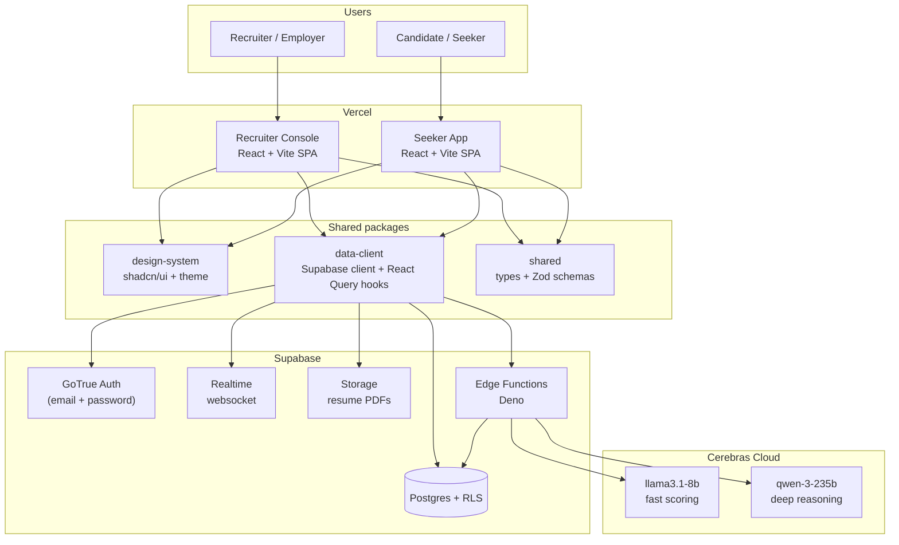
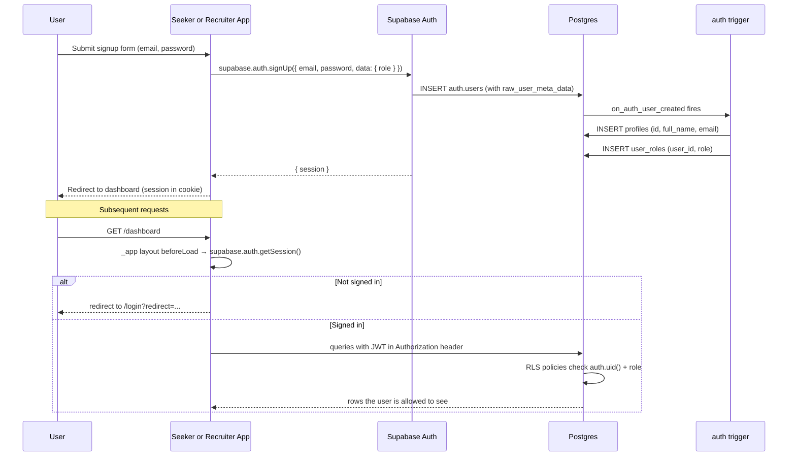
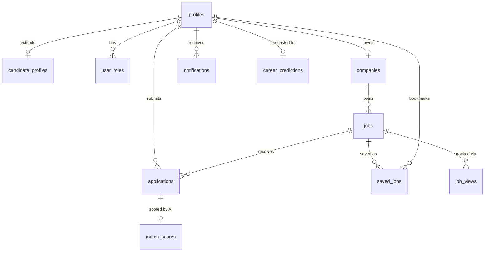
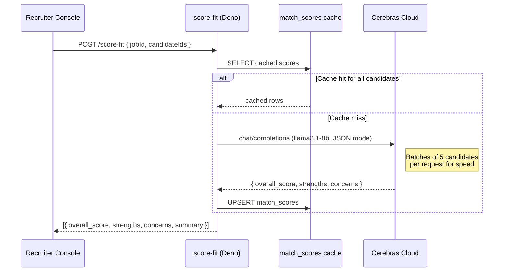
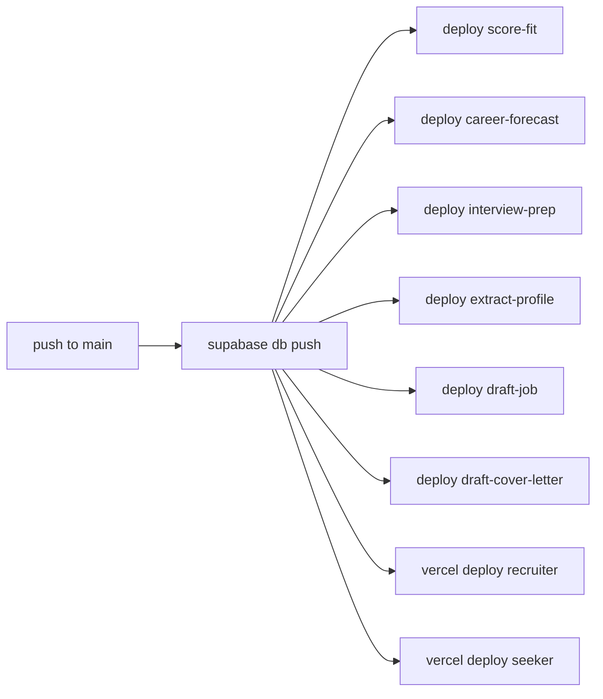

<div align="center">

# Talentforge

### An AI-powered two-sided job matching platform

_A recruiter console and a candidate app sharing one Supabase backend, with Cerebras-hosted LLMs scoring every applicant._

<br />


<br />

[**Test accounts**](#test-accounts) · [**Setup**](#setup) · [**Architecture**](#architecture) · [**AI integration**](#ai-integration) · [**Security & RLS**](#security--rls) · [**Deviations from the brief**](#deliberate-deviations-from-the-brief)

<br />

### 🌐 Live demo

| Portal               | URL                                                   |
| -------------------- | ----------------------------------------------------- |
| 🏢 Recruiter Console | **https://talentforge-recruiter-console.vercel.app/** |
| 👤 Seeker App        | **https://talentforge-seeker-app.vercel.app/**        |

_Sign in with any account from the [test accounts table](#test-accounts) — the hosted Supabase project is preseeded._

### 🎬 Demo video

<!--
  YouTube (preferred): replace VIDEO_ID below with the ID from your URL.
    If your link is https://youtu.be/abc123XYZ  →  VIDEO_ID = abc123XYZ
    If it's https://www.youtube.com/watch?v=abc123XYZ  →  same ID.

  Google Drive fallback: comment out the YouTube line and uncomment the
  Drive line, then paste your shareable Drive link.
-->

[](https://youtu.be/VIDEO_ID)

<!-- Google Drive fallback (anyone with the link can view):
▶ [**Watch the 5-minute demo on Google Drive**](https://drive.google.com/file/d/FILE_ID/view?usp=sharing)
-->

_Covers: employer job-creation with AI draft · AI-scored applicants · candidate apply + cover-letter AI · role separation (candidate can't see AI scores) · realtime status updates._

</div>

---

## Table of contents

- [What's new](#whats-new)
- [Overview](#overview)
- [Test accounts](#test-accounts)
- [Setup](#setup)
- [Environment variables](#environment-variables)
- [Architecture](#architecture)
- [Authentication flow](#authentication-flow)
- [Database schema](#database-schema)
- [AI integration](#ai-integration)
- [Security & RLS](#security--rls)
- [Deliberate deviations from the brief](#deliberate-deviations-from-the-brief)
- [Deployment](#deployment)
- [Project structure](#project-structure)

---

## What's new

Highlights shipped during iteration on the initial implementation.

### Features

- **AI Cover Letter Assistant (6th edge function)** — candidate clicks "Generate with AI" on the apply form, a new `draft-cover-letter` Cerebras function composes a 3-paragraph personalized letter from the candidate profile + job description. Editable, regeneratable.
- **Realtime application status** — when a recruiter flips an applicant's status (e.g. `reviewing` → `shortlisted`), the seeker's dashboard and application views update live over Supabase Realtime. No refresh needed. Works both directions.
- **Notifications realtime** — bell badge updates the moment a new notification lands, without reload.
- **View-count tracking** — opening a job detail page inserts a `job_views` row (once per session), driving the recruiter's "Job views (total)" dashboard card.
- **Instant match scores on direct landings** — opening a job detail page by URL (not via the browse page) now auto-triggers the `score-fit` edge function and displays the score when it lands.
- **Interview prep button on every live application** — reachable through the applicant detail page at any status except `rejected` / `withdrawn`.

### UX polish

- **Rich-color toasts** — `toast.success` green, `toast.error` red, `toast.warning` orange, each with a leading icon + close button.
- **Inline form errors** — every form (auth, settings, job creation, profile editor) surfaces validation errors directly below the offending field. Profile editor JSON fields, URL fields, salary min/max, and notice period are all validated client-side before round-tripping to Supabase.
- **Profile save self-heal** — the profile upsert flow now works even for accounts whose `handle_new_user` trigger didn't run; new RLS INSERT policies + a unique-email guard on `profiles` were added.
- **Mobile hamburger nav** — both apps now collapse their sidebar into a slide-over drawer below the `md` breakpoint.
- **Sticky sidebar with always-visible signout** — the sidebar stays pinned to the viewport height, and long pages no longer push the signout below the fold.
- **Topbar + sidebar alignment** — the top-bar content is centered within the same `max-w-6xl` container as page content, so the search bar's left edge lines up with the page heading.
- **Cursor pointer everywhere** — a single CSS rule ensures every `<button>`, `[role="button"]`, and `<a href>` gets the pointer cursor; disabled buttons show `not-allowed`.
- **Notification badge polish** — the unread counter is now a true circle with tabular-number digits so 1 vs 2-digit counts don't shift center.
- **Favicons** — both apps ship a matching orange-zap SVG favicon.
- **Equal-height dashboard cards** — the "Profile completeness" card lines up with the three metric cards next to it.

### Reliability

- **Per-job match-score cache seeded by the mutation** — fixed a cache-key mismatch where `useCalculateMatch`'s result populated only the aggregate map, not the single-job query the detail page reads from.
- **Channel dedup on realtime hooks** — `useNotifications` was split into pure-query and realtime-subscription halves so mounting it in two places no longer trips `@supabase/realtime-js`'s duplicate-topic guard.
- **Email-unique profiles** — belt-and-suspenders migration that case-insensitively enforces `UNIQUE(lower(email))` on `profiles`, so a single email can never produce two app-side identities.

---

## Overview

Two independent SPAs share one Supabase project:

| Portal                                           | Who uses it                 | Dev URL                 | Live URL                                                                                      |
| ------------------------------------------------ | --------------------------- | ----------------------- | --------------------------------------------------------------------------------------------- |
| **Recruiter Console** (`apps/recruiter-console`) | Employers & hiring managers | `http://localhost:5173` | [talentforge-recruiter-console.vercel.app](https://talentforge-recruiter-console.vercel.app/) |
| **Seeker App** (`apps/seeker-app`)               | Job seekers & candidates    | `http://localhost:5174` | [talentforge-seeker-app.vercel.app](https://talentforge-seeker-app.vercel.app/)               |

**The AI grading loop**: when a candidate applies, the employer sees a **0-100 fit score** plus top strengths and concerns — generated by a Cerebras edge function, cached in Postgres, and locked down so the candidate never sees any of it.

---

## Test accounts

Populated by `pnpm demo:seed`. Every account has `email_confirm = true`, so you can sign in immediately.

### Employers (each owns a company + at least one job)

| Email                       | Password          | Role                                          |
| --------------------------- | ----------------- | --------------------------------------------- |
| `employer1@talentforge.dev` | `Employer1-Demo!` | Avery Chen — owns **Nimbus Systems** (2 jobs) |
| `employer2@talentforge.dev` | `Employer2-Demo!` | Morgan Patel — owns **Helio Labs** (1 job)    |

### Candidates (each with a completed profile + applications)

| Email                        | Password           | Role                                                |
| ---------------------------- | ------------------ | --------------------------------------------------- |
| `candidate1@talentforge.dev` | `Candidate1-Demo!` | Jordan Rivera — senior TS engineer (2 applications) |
| `candidate2@talentforge.dev` | `Candidate2-Demo!` | Sam Kim — junior frontend (1 application)           |
| `candidate3@talentforge.dev` | `Candidate3-Demo!` | Riley Park — ML platform engineer (2 applications)  |

**5 applications** span `pending`, `reviewing`, `interviewing`, and `offer` states. Every application has a **precomputed `match_scores` row** (realistic strengths + concerns) so the score panel renders even without a live Cerebras key — the live flow still works when the key is set.

---

## Setup

### Prerequisites

| Tool           | Version  | Windows install                    | Mac install                          |
| -------------- | -------- | ---------------------------------- | ------------------------------------ |
| Node.js        | ≥ 20 LTS | [nodejs.org](https://nodejs.org)   | `brew install node@20`               |
| pnpm           | ≥ 10     | `npm i -g pnpm`                    | `brew install pnpm`                  |
| Docker Desktop | latest   | [docker.com](https://docker.com)   | [docker.com](https://docker.com)     |
| Supabase CLI   | latest   | `scoop install supabase`           | `brew install supabase/tap/supabase` |
| Git            | any      | [git-scm.com](https://git-scm.com) | built in                             |

### 1. Clone + install

```bash
git clone https://github.com/shubhamkarad/talentforge.git
cd talentforge
pnpm install
```

### 2. Configure env

```bash
cp .env.example .env.local
```

Fill in `.env.local` per the [table below](#environment-variables).

### 3. Start local Supabase

```bash
pnpm supabase:start
```

This boots Postgres + Auth + Realtime + Storage + Studio in Docker. All migrations in `supabase/migrations/` apply automatically. When it finishes, copy the printed `API URL`, `anon key`, and `service_role key` into `.env.local`.

### 4. Generate typed DB client

```bash
pnpm supabase:types
```

Regenerates `packages/data-client/src/types/database.ts` from the live schema.

### 5. Seed demo data

```bash
SUPABASE_URL=http://localhost:54321 \
SUPABASE_SERVICE_ROLE_KEY=<service_role_key_from_step_3> \
pnpm demo:seed
```

This script **resets the DB and re-seeds it** with the 5 test accounts, 2 companies, 3 jobs, 5 applications, and precomputed match scores.

### 6. Run both apps

```bash
pnpm dev
```

- Recruiter Console → http://localhost:5173
- Seeker App → http://localhost:5174

Sign in using any account from the [test accounts table](#test-accounts).

---

## Environment variables

Place these in `.env.local` at the **repo root** (Vite reads them via `envDir: '../../'` in each app's `vite.config.ts`):

| Variable                    | Required              | Example / how to get it                                          |
| --------------------------- | --------------------- | ---------------------------------------------------------------- |
| `VITE_SUPABASE_URL`         | ✅                    | `http://localhost:54321` (local) or hosted project URL           |
| `VITE_SUPABASE_ANON_KEY`    | ✅                    | `eyJ...` — from Supabase dashboard → Settings → API              |
| `SUPABASE_SERVICE_ROLE_KEY` | for seed script       | `eyJ...` — same dashboard page, never ship to the browser        |
| `DATABASE_URL`              | for direct migrations | `postgresql://postgres:<pwd>@db.<ref>.supabase.co:5432/postgres` |
| `CEREBRAS_API_KEY`          | for AI features       | `csk-...` — from [cloud.cerebras.ai](https://cloud.cerebras.ai)  |

---

## Architecture

Talentforge is **serverless-first**: the browser talks to Postgres through Supabase's auto-generated REST layer, and Row-Level Security policies in the database are the authorization layer. There is no custom Node/Express backend of our own.



**Why two apps, not one?** Keeps candidate code out of the recruiter bundle (and vice versa), prevents role-check leakage through bundle analysis, and lets each portal evolve independently.

---

## Authentication flow

Supabase Auth (GoTrue) handles signup, signin, session cookies, and password reset emails.



**Role assignment** is enforced on the client (each app's signup page hardcodes its role) **and** on the server (the `0005_auth_hook.sql` trigger syncs the role into `user_roles`). Role cannot be changed from the browser post-signup.

---

## Database schema

Eleven tables, all with RLS enabled. Migrations live in `supabase/migrations/`.



| #   | Table                | Purpose                                                                  |
| --- | -------------------- | ------------------------------------------------------------------------ |
| 1   | `profiles`           | Every user — 1:1 with `auth.users` via FK + trigger                      |
| 2   | `user_roles`         | `employer` or `candidate` — drives every RLS policy                      |
| 3   | `companies`          | Employer organizations (name, logo, size, website)                       |
| 4   | `candidate_profiles` | Headline, bio, skills, experience JSONB, education JSONB                 |
| 5   | `jobs`               | Postings with generated `fts` column for full-text search                |
| 6   | `applications`       | Candidate ↔ job join table with status enum lifecycle                    |
| 7   | `match_scores`       | Cached AI scores (0-100 + strengths + concerns) — **employer-only read** |
| 8   | `career_predictions` | Cached 1/3/5-year forecast JSON — candidate-only                         |
| 9   | `notifications`      | In-app bell alerts (realtime)                                            |
| 10  | `saved_jobs`         | Candidate bookmarks                                                      |
| 11  | `job_views`          | Analytics                                                                |

**Constraints worth calling out:**

- `applications` has `UNIQUE(candidate_id, job_id)` — a candidate can't apply twice.
- `match_scores` has `UNIQUE(candidate_id, job_id)` — the cache is idempotent.
- `application_status` is a Postgres enum: `pending · reviewing · shortlisted · interviewing · offer · hired · rejected · withdrawn`.
- Every table has `updated_at` auto-maintained by a trigger.
- `jobs.applications_count` + `jobs.views_count` are auto-incremented by triggers, not maintained from the frontend.

---

## AI integration

Six edge functions live in `supabase/functions/`, all going through one shared helper (`_shared/cerebras.ts`) so the provider is swappable in a single file. Only the primary AI feature (**score-fit**) is covered in depth here; the rest follow the same contract.

### The core scoring flow



### Prompt design — `score-fit`

The system prompt (in `supabase/functions/score-fit/index.ts`) is:

1. **Role-framed**: "You are a hiring expert grading candidate-job fit." — not a blank "you are an AI assistant."
2. **Schema-locked**: Responds with `response_format: { type: 'json_object' }` and the user message includes the exact JSON schema the edge function will `JSON.parse()`. No free-form prose.
3. **Deterministic-ish**: `temperature: 0.3` — we want stable scoring across reruns, not creative variation.
4. **Batched**: 5 candidates per call, each with their profile + the job description inline. This keeps the total round-trips low (one request covers a whole page of applicants) while staying under token limits.
5. **Cached**: The `match_scores` table has `UNIQUE(candidate_id, job_id)` — the edge function UPSERTs after each call, so a second visit to the applications page is a cache hit. Reviewers see instant scores without spending Cerebras tokens every time.

### What the employer sees

- `overall_score` — 0-100, rendered as a colored circular ring.
- `skills_score` + `experience_score` — component breakdown (same scale).
- `summary` — one-line executive summary.
- `strengths` — top 3 bullet points, each citing a specific overlap with the job requirements.
- `concerns` — red flags / gaps, each citing a specific requirement the candidate doesn't obviously meet.

All five fields are surfaced in `apps/recruiter-console/src/features/applications/score-panel.tsx`.

### The other four edge functions

| Function             | Model         | Trigger                                      | Notes                                                                          |
| -------------------- | ------------- | -------------------------------------------- | ------------------------------------------------------------------------------ |
| `career-forecast`    | `qwen-3-235b` | Candidate opens `/career`                    | 1/3/5-year trajectory JSON, cached per candidate                               |
| `interview-prep`     | `qwen-3-235b` | Application status = `interviewing`          | 5-8 role-specific questions + talking points                                   |
| `extract-profile`    | `qwen-3-235b` | Candidate uploads resume PDF                 | Uses `unpdf` for text extraction, returns structured JSON for autofill         |
| `draft-job`          | `qwen-3-235b` | Recruiter clicks "Draft with AI"             | Title + notes → full posting (description, requirements, responsibilities)     |
| `draft-cover-letter` | `qwen-3-235b` | Candidate clicks "Generate with AI" on apply | Candidate profile + job → personalized 3-paragraph cover letter, regeneratable |

---

## Security & RLS

Instead of writing a custom auth middleware, **Postgres enforces authorization at the row level**. Every query goes through RLS policies keyed off the JWT's `auth.uid()` and the `user_roles` table.

### The three anchor policies that enforce the brief

**1. Candidates cannot see AI scores** (the primary security requirement):

```sql
-- supabase/migrations/20260422000004_rls.sql
create policy match_scores_select_employer
  on public.match_scores for select
  using (
    exists (
      select 1 from public.jobs j
      where j.id = match_scores.job_id
      and j.employer_id = auth.uid()
    )
  );
```

No policy allows candidates to SELECT `match_scores`. The seeker app doesn't query the table at all — and if it did, Postgres would return an empty list.

**2. Employers can only see applications to their own jobs**:

```sql
create policy applications_select_own_employer
  on public.applications for select
  using (
    exists (
      select 1 from public.jobs j
      where j.id = applications.job_id
      and j.employer_id = auth.uid()
    )
  );
```

**3. Notifications are scoped to the signed-in user**:

```sql
create policy notifications_select_own
  on public.notifications for select
  using (user_id = (select auth.uid()));
```

### How to verify RLS yourself

In a candidate session, open DevTools and paste:

```js
const { createClient } = await import('@supabase/supabase-js');
const sb = createClient(import.meta.env.VITE_SUPABASE_URL, import.meta.env.VITE_SUPABASE_ANON_KEY, {
  auth: { persistSession: true },
});
const { data } = await sb.from('match_scores').select('*');
console.log(data); // → []  (RLS hides every row)
```

Even with a bug in the frontend that accidentally queries `match_scores`, the server returns an empty array.

### Other security measures

- **Password policy**: GoTrue default (8+ chars); demo passwords meet it.
- **HTTPS-only cookies** for session persistence in production.
- **Service role key** never ships to the browser — only used server-side in `scripts/demo-reset-and-seed.mjs`.
- **CORS** configured per edge function via `_shared/cors.ts`.
- **SPA headers** in each app's `vercel.json`: `X-Frame-Options: DENY`, `X-Content-Type-Options: nosniff`, `Referrer-Policy: strict-origin-when-cross-origin`.

---

## Deliberate deviations from the brief

Two choices depart from the brief's literal text. Both are documented here because the reviewer should see the reasoning.

### 1. Cerebras instead of OpenAI / Claude

The brief says "Claude (Anthropic) or OpenAI (free)". We use **Cerebras Cloud**.

**Why**: Cerebras serves Llama + Qwen at ~2000 tok/s — roughly an order of magnitude faster than GPT-4o or Claude Haiku. The recruiter-facing scoring loop feels instant instead of async. The API is **OpenAI-compatible**, so swapping back is a two-line change in `supabase/functions/_shared/cerebras.ts`:

```ts
// Current:
const CEREBRAS_ENDPOINT = 'https://api.cerebras.ai/v1/chat/completions';
// Swap to OpenAI:
const CEREBRAS_ENDPOINT = 'https://api.openai.com/v1/chat/completions';
// ...and update model pins in CEREBRAS_MODELS to 'gpt-4o-mini', etc.
```

The prompt engineering, caching, error handling, and response parsing are all provider-agnostic.

### 2. Claude Code instead of Cursor

The brief asks for Cursor-AI evidence. This project was built with **Claude Code** (Anthropic's official CLI). It is the same class of tool — an AI-pair-programming IDE assistant — and produces the same category of evidence (AI-generated code, test feedback loops, refactors). Commit messages carry the `Co-Authored-By: Claude` trailer as a record.

---

## Deployment

### Vercel (web apps)

Each app has its own `vercel.json` and is deployed as a separate Vercel project:

1. Import the repo at [vercel.com/new](https://vercel.com/new).
2. Set **Root Directory** to `apps/recruiter-console` (or `apps/seeker-app`).
3. **Build Command**: `cd ../.. && pnpm --filter @forge/recruiter-console build`
4. **Install Command**: `cd ../.. && pnpm install --frozen-lockfile`
5. Add env vars `VITE_SUPABASE_URL` + `VITE_SUPABASE_ANON_KEY`.

### Supabase (DB + edge functions)

Automated by `.github/workflows/deploy.yml` on every push to `main`:



**Required GitHub repo secrets**: `VERCEL_TOKEN`, `VERCEL_ORG_ID`, `VERCEL_PROJECT_ID_RECRUITER`, `VERCEL_PROJECT_ID_SEEKER`, `SUPABASE_ACCESS_TOKEN`, `SUPABASE_PROJECT_REF`, `SUPABASE_DB_PASSWORD`, `CEREBRAS_API_KEY`.

---

## Project structure

```
talentforge/
├── apps/
│   ├── recruiter-console/      # React SPA — employer portal (:5173)
│   └── seeker-app/             # React SPA — candidate portal (:5174)
├── packages/
│   ├── design-system/          # shadcn/ui components + theme + motion primitives
│   ├── shared/                 # Types, Zod schemas, constants, utils
│   └── data-client/            # Supabase client + TanStack Query hooks
├── supabase/
│   ├── migrations/             # SQL schema, RLS, triggers, seed hooks
│   └── functions/              # 5 Deno edge functions + _shared helpers
├── scripts/
│   ├── run-migrations.mjs
│   └── demo-reset-and-seed.mjs # Reset DB + seed 5 accounts + 5 applications
├── .github/workflows/
│   ├── ci.yml                  # Lint + typecheck + build on PR
│   └── deploy.yml              # Migrate + deploy functions + deploy Vercel
├── Makefile                    # Developer shortcuts
├── turbo.json
├── pnpm-workspace.yaml
├── package.json
└── .env.example
```

---

<div align="center">

Built with React, Supabase, and Cerebras.

</div>
